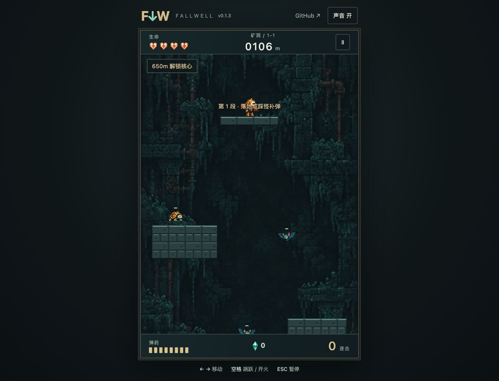

# 坠井者 · FALLWELL

向井底不断下落，靠射击减速、踩怪连击与落地补弹构筑自己的动作肉鸽。

A descent roguelite with shot-assisted falls, stomp combos, reloads, cores and relic builds.

[在线体验](https://fallwell.xiaosang.cc/) · [源码](https://github.com/holynova/fallwell)



## 可以做什么

- 选择角色，搭配核心与可升级遗物。
- 探索不同区域，挑战井底守卫。

## 怎么玩

A/D或左右键移动，空格跳跃 / 空中射击；落地补弹。更多操作见游戏内提示。

## 本地运行

```bash
npm ci
npm run dev
# 生成生产产物
npm run build
```

这是受Downwell启发的原创项目。玩法和构筑说明见 [开发计划](DEVELOPMENT_PLAN.md) 与 [肉鸽设计](ROGUELITE_REDESIGN.md)。


## 发布

```bash
npm run deploy
```

从 `main` 同一提交在本地手动发布到Cloudflare Workers。正式地址：[https://fallwell.xiaosang.cc/](https://fallwell.xiaosang.cc/)。
