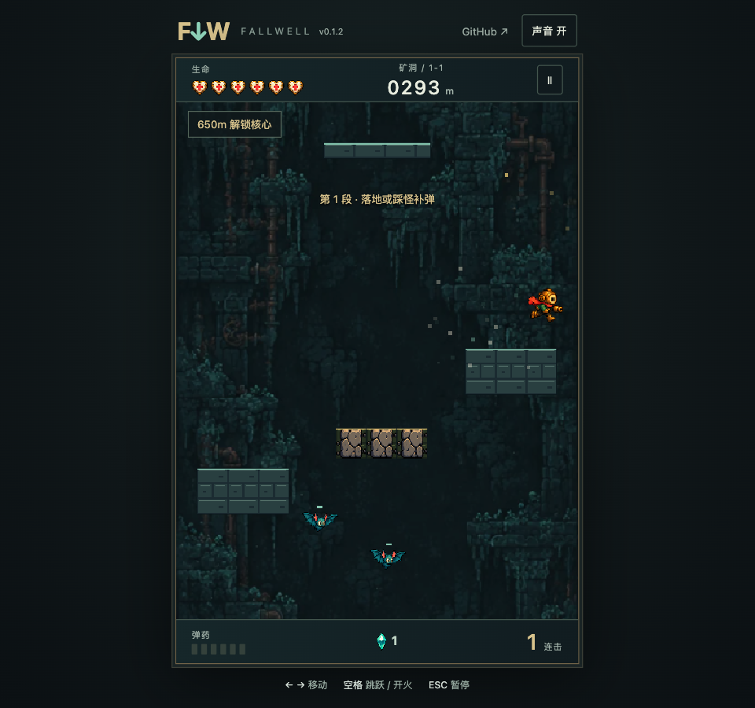

# 坠井者 / FALLWELL

中文：受 Downwell 启发的原创浏览器下落动作肉鸽。选择四名角色之一，在四区十二关中射击减速、踩怪连击、落地补弹，迎战井底守卫。弹幕、跃击、陨落三种核心搭配最多四件两级遗物，同类组合可进化。窗口尺寸变化时，游戏与菜单自动缩放，首屏完整显示。

English: An original browser descent roguelite inspired by Downwell. Pick one of four characters, shoot to slow your fall, stomp enemies for combos, and reload on contact. Explore twelve levels across four biomes and fight the well guardian. Three exclusive cores combine with four upgradable relic slots and core evolutions. The game and menus scale to fit the browser window.



## 在线体验 / Live Demo

- [Cloudflare Demo](https://xiaosang.cc/fallwell/)（正式路径待验证 / Public path verification pending）
- [GitHub Repo](https://github.com/holynova/fallwell)


## 操作 / Controls

← → / A D 移动 / Move · 空格跳跃或开火 / Space to jump or shoot · Esc 暂停 / Pause。
空中不自动补弹。使用电脑键盘游玩；手机仅适配页面，尚无触控。
A keyboard is required. Mobile layout adapts, but touch controls are not implemented.

## 本地运行 / Run locally

```bash
npm ci
npm run dev
npm test
npm run build
npm run preview
```

## 发布 / Deploy

```bash
npm run build
npm run deploy:check
npm run deploy
```

Phaser · TypeScript · Vite · Cloudflare Workers Static Assets。
唯一源码分支为 main；从同一提交在本地手动部署，无自动 Cloudflare 发布。
Source and deployment configuration share main; deploy manually from the same commit.

玩法、素材与验证记录见 DEVELOPMENT_PLAN.md、ART_DIRECTION.md、AUDIO_DIRECTION.md 和 ROGUELITE_REDESIGN.md。游戏平衡仍持续调校。

使用独立 fallwell Worker 的 /fallwell/ 路由复用主域名，避免新增自定义域名配额。
The independent fallwell Worker is mounted at /fallwell/ on the portfolio host.
